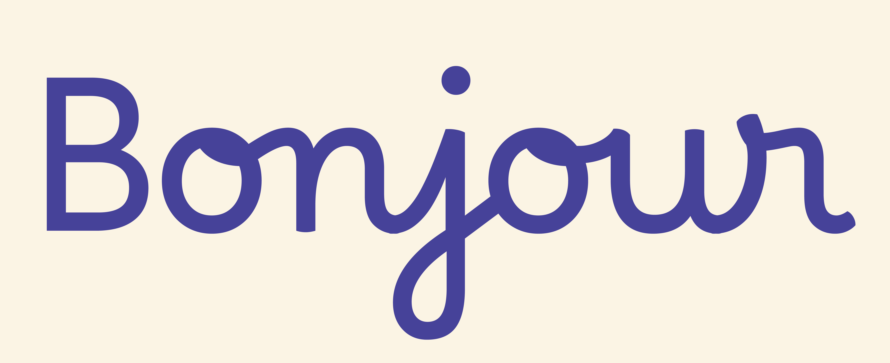
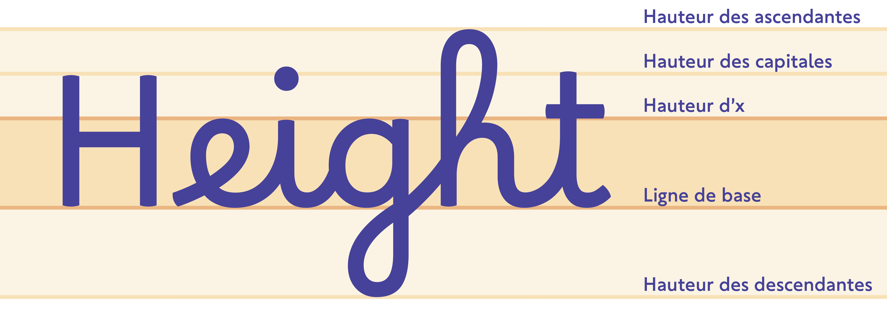
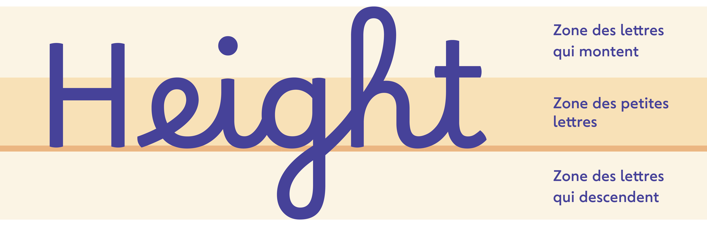
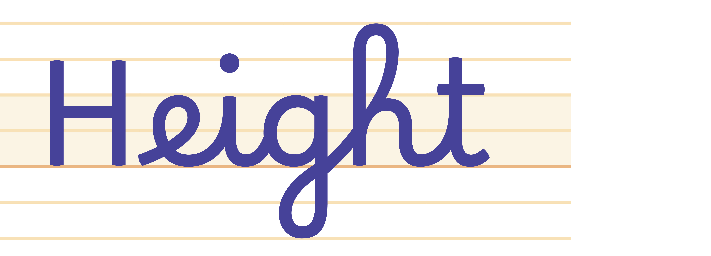
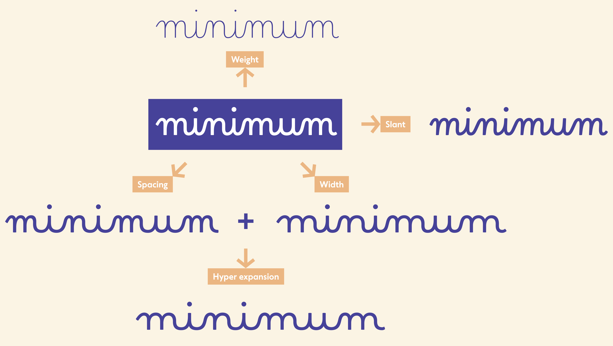
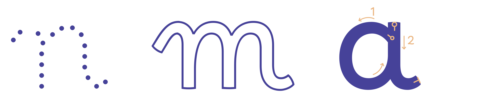

# Borel, un système typographique pour l'école primaire

## Apprendre à lire, apprendre à écrire

Comment penser la typographie pour l’apprentissage conjoint de la lecture et de l’écriture? Développé avec des enseignants du primaire et des orthophonistes, ce projet cherche à reconnecter les signes que l'on apprend à lire et ceux que l’on apprend à écrire. 

Un système typographique a donc été pensé dans cette logique, pour établir une continuité entre tracé cursif et forme typographique. **Borel** et **Borel Sans** (nommés en hommage à Suzanne Borel-Maisonny, pionnière de l’orthophonie) sont des caractères robustes, peu contrastés, avec une grande hauteur d'x. Les lettres sont ouvertes et bien distinctes, tout en respectant les règles de l’écriture dans les écoles françaises. **Borel Guides**, qui permet d'afficher des lignes de cahier, vient compléter ce système qui met en valeur l'accessibilité, l'adaptabilité et la cohérence.

Une utilisation harmonieuse des caractères dans les documents pédagogiques est rendue possible grace à leur caractéristiques communes; graisse, proportions, alignements et ductus.

**J'invite les enseignants à me faire leur retour d'utilisation de Borel après avoir expérimenter avec leur élèves. Idéalement, une étude expérimentale rigoureuse confirmer ou réfuter mes hypothèses. J'invite donc aussi les chercheurs intéressés à me contacter s'ils veulent que je produise un matériel expérimental adapté à une telle démarche.**

## Lexique
Les termes typographiques sont nombreux et imposent de nombreux repères qui peuvent perturber l’attention. Cependant, il est important pour l'adulte de les connaitre pour comprendre le projet Borel et la suite de cette documentation.

Pour les enfants, on peut simplifier en parlant de « zones ». Cela amène plus de liberté dans l’exercice d’écriture et c’est aussi plus logique par rapport aux différentes tailles des ascendantes qu'on retrouve conventionnellement en typographie. 

## Les proportions

Les proportions de polices cursives d'école traditionnelles sont disprortionnées par rapport au polices d'écriture de l'usage courant — que l'on retrouve dans les livres, sur les écrans ou la signalétique. Si on regarde les cursives scolaires, les ascendantes seraient censé faire trois fois la taille de la hauteur d'x. Sachant que la taille des lettres est limitée aux lignes du cahier, cela veut dire que la hauteur d'x est écrasée entre deux lignes qui, le plus souvent, font 1.5 ou 2mm de hauteur. Ces proportions sont héritées de l'utilisation conjointe des fameuses réglures Séyès et d'un style calligraphique propres à l'utilisation des plumes à reservoir des siècles précédents.

Hors, c'est la hauteur de la "zone des petites lettres" qui va conditionner la lisibilité du mot. En effet, les lettres qui sont contenues entre la ligne de base et la hauteur d'x constituent environ 65% de notre alphabet (sans compter les lettres accentuées), en plus de cummuler la plus grande fréquence d'apparition dans le français (environ 80%) [^1]. C'est aussi cette zone qui contient le plus de formes signifiantes pour le déchiffrage. Il parait donc absurde de donner autant d'importance aux capitales, ainsi qu'aux ascendantes/descendantes. Je ne développerai pas davantage ici tous les autres arguments qui vont dans ce sens; le rapport que j'ai écrit lors mon post-master à l'ANRT en 2019 fait l'état de la recherche sur les rapports entre typographie, lisibilité et dyslexie, je vous invite à le lire (mise en ligne ici bientôt). D'autres études ont été publiées depuis, et à ma connaissance elles n'ont pas contredit mes conclusions. 

**Nous retiendrons que:**
1. La taille perçue d'une police va paraitre plus ou moins grande en fonction du rapport entre hauteur d'x et hauteur d'ascendante. Par exemple, lorsque *Times New Roman* ou *Arial* sont composé en corps 12pt, *Arial* paraitra plus grande car sa hauteur d'x est plus haute.[^2] 

2. Un interlignage trop serré ou trop grand impacte négativement la lisibilité.[^3] Le problème des ascendantes 3x plus grandes que la hauteur d'x est que, premièrement, plus la hauteur d'x est petite, et plus il faudra compenser la perte de lisibilité en augmentant la taille du corps. Deuxièment, il faudra un interlignage très grand pour éviter que les ascendantes et les descendantes ne s'entrechoque d'une ligne à l'autre, ce qui risque d'impacter négativement la lisibilité d'un paragraphe.

3. Pour la lecture continue d'un texte à une distance standard de 40cm, par un adulte normolecteur, la hauteur d'x devrait de trouver entre 1.5mm et 14mm pour rester lisible.[^4] 1.5mm est la taille minimum sur le spectre de la lisibilité pour un adulte (!). Des études ont démontré que les apprentis lecteurs, et particulèrement ceux présentant des troubles dys, bénéficiaient à lire des caractères légèrement plus grand.[^5] L'étude retenue pour soutenir cette thèse fait le cas de Times New Roman donnant de meilleurs resultats de lecture à 18pt jusqu'à la fin du CE1; cela correspond à une hauteur d'x de 2.84mm, ce qui correspond à Borel en 16pt. Ces chiffres ne sont bien sûr pas absolus et général à tous les enfants, mais ça donne une idée.

4. Lors de l'apprentissage de l'écriture, il est important d'entrainer les doigts et les yeux à bien faire la différence entre les petites et les grandes lettres. Il faut arriver à une taille qui permette d'entrainer les muscles des doigts — passer de petites boucles à grande boucles en ne bougeant que les doigts, pas les mains. Il faut donc une claire différence entre hauteur d'x et ascendente, mais j'ajouterai: sans pour autant exagérer cette différence au risque d'impacter négativement la lisibilité.

**Le défi que doit donc relever la police Borel est celui du juste compromis entre hauteur d'x et ascendante pour permettre:** 
- une lisibilité non contraignante
- la clarté du déchiffraphe des graphèmes
- l'entrainement au geste d'écriture
- l'adaptation aux lignes du cahier

J'ai donc adapté les proportions du Borel afin que la hauteur d'x corresponde à deux lignes du cahier, et que la hauteur des grandes boucles corresponde à quatre. Ce qui permet une meilleure harmonie avec la version Sans Serif (baton) du Borel.

**Pourquoi les capitales sont-elles plus petites que les grandes boucles?** 

Conventionnellement, la hauteur des capitales est la même que la hauteur des ascendantes, ou légèrement plus petites. Ceci dans le cas où les ascendentes sont droites comme dans n'importe quelle Serif (ex. Times New Roman), ou Sans-Serif (ex: Arial, Comic Sans). Dans l'écriture cursive en France, nous utilisons la boucle pour joindre l'ascendante par le haut; l'amplitude de la boucle augmente la hauteur de l'ascendante. Mais les lettres comme t, d, q, ainsi que les capitales qui ne bénéficient pas de cette jonction, sont donc plus petites que les grandes boucles.

## Borel Sans

Borel Sans est la contre-partie Sans-Serif de Borel. 

## Borel Guides

**Borel Guides** est une police pour tracer des lignes de cahier. Elle se superpose parfaitement à la police Borel. Elle contient différentes palettes de couleurs, pour s'ajuster à la préférence des petits écrivains, mais aussi un grand choix de motifs linéaires pour s'adapter à l'objectif pédagogique, à la police utilisée, etc.

Veuillez trouvez toutes les informations sur le police **Borel Guides** dans ce document:
[Borel Guides Instructions](./documentation/proof/BorelGuides-Instructions.pdf).

- L’interlignage est déjà réglé pour les logiciels de traitement de text communs comme Word, Page ou TextEdit. Il correspond à un interlignage de taille 1 dans votre logiciel. Si vous voulez resserer les lignes, utilisez un interlignage 0,5 pour que les lignes se superposent parfaitement. Dans Indesign, vous devrez observer un interlignage double pour permettre la parfaite imbrication de la grille d’une ligne à l’autre. Si vous choississez une taille de police 24 pt, choissisez un interlignage de 48 pt.

- Borel Guides est une *Color Font*. C’est un format particulier qui permet à une police de contenir et de rendre à l'écran des palettes de couleurs. Si vous ne voyez pas les couleurs dans votre logiciel de traitement de texte, cela signifie que votre logiciel ne supporte pas cette technologie. 

- Borel Guides est aussi une police *variable*. C’est un format qui permet de modifier la police sur différents axes comme par exemple: la largeur et l’épaisseur. Il est conseillé de ne pas utiliser [la police variable](./fonts/BorelGuides/variable/) dans vos logiciels de traitement de texte, elle est plutôt destinée au web. Utiliser des polices dites [statiques](./fonts/BorelGuides/ttf/). En effet, beacoup de logiciels supportent les polices colorées, et supportent les polices variables, mais pas les polices colorées et variable.

## À venir

Si je trouve les financements, j'aimerais developper le projet Borel pour lui permettre de s'adapter encore mieux aux besoins des enseignants et de la recherche.

**Axes de variabilité:**
- [ ] Weight (graisse)
- [ ] Width (chasse) 
- [ ] Spacing (espacement)
- [ ] HyperExpansion (chasse + espacement)
- [ ] Slant (oblique)

- [ ] Ascender-height (hauteur des ascendantes)
- [ ] Caps-height (heuteur des capitales)
- [ ] x-height (hauteur d'x)

**Styles:**
- [ ] Dotted (pointillés)
- [ ] Outlined (contours)
- [ ] Guided (guidé)

**Alternates:**
- [ ] Simplified cursive capitals (capitales cursives simplifiées)
- [ ] Swashed capitals (capitales cursives ornées)

## Bio

[Rosalie Wagner](http://rosaliewagner.com) est diplômée d'un master des Beaux-Arts de Lyon en 2016, et d'un post-master de l'ANRT Nancy (Atelier National de Recherche typographique) en 2019. Elle s'est formée à l'ingénierie de fonte chez Black Foundry (Paris) et Alphabet Type (Berlin). Elle est maintenant basée à Berlin et travaille en tant que Type designer et Font engineer indépendantes pour Google Fonts depuis 2020. Elle a collaboré régulièrement avec des foundries comme 205TF, Fontwerk, NaN  et Fatype, ainsi que divers designers indépendants et studios de communication.

- **Présentation du projet Borel à l'ANRT**, 2019, [[Video](https://anrt-nancy.fr/fr/videos#video-325200518)]
- **Baskervville**, 2017, [[Google Fonts](https://fonts.google.com/specimen/Baskervville)] — *conception collaborative, design de l'italique, correction et développement du Romain, production de la fonte.*
- **Arima Greek**, 2018, [[Google Fonts](https://fonts.google.com/specimen/Arima?noto.script=Grek&query=Arima&subset=greek)] — *conception et design du grec d'Arima de NDiscover sous la direction d'Emilios Theofanous et Irene Vlachou.*

## License

This Font Software is licensed under the SIL Open Font License, Version 1.1.
This license is available with a FAQ at https://scripts.sil.org/OFL

## Repository Layout

This font repository structure is inspired by [Unified Font Repository v0.3](https://github.com/unified-font-repository/Unified-Font-Repository), modified for the Google Fonts workflow.

### Notes

[^1]: L'Université de Toulouse a recensé en 2008 [la fréquence des lettres dans tout le Wikipedia français](https://fr.wikipedia.org/wiki/Fréquence_d%27apparition_des_lettres).

[^2]: *[Does print size matter for reading? A review of findings from vision science and typography](https://jov.arvojournals.org/article.aspx?articleid=2191906#88123043)*, Gordon E. Legge; Charles A. Bigelow, Journal of Vision August 2011, Vol.11, 8. doi:https://doi.org/10.1167/11.5.8

[^3]: *[Influence de la typographie sur l’aisance de lecture d’une population d’enfants dyslexiques. Master Thesis.](https://dumas.ccsd.cnrs.fr/dumas-01302521/document)*, Klein V., Bordeaux : Université de Bordeaux, 2010.

[^4]: [Does print size matter for reading? A review of findings from vision science and typography](https://jov.arvojournals.org/article.aspx?articleid=2191906#88123043), *op. cit.*

[^5]: *[Influence de la typographie sur l’aisance de lecture d’une population d’enfants dyslexiques. Master Thesis.](https://dumas.ccsd.cnrs.fr/dumas-01302521/document)*, Klein V., *op. cit.*

[^6]: *[Le geste d'écriture](https://legestedecriture.fr), Méthode d'apprentissage Cycle 1 • Cycle 2, Différenciation et transversalité*, Danièle Dumont, Hatier, 2016