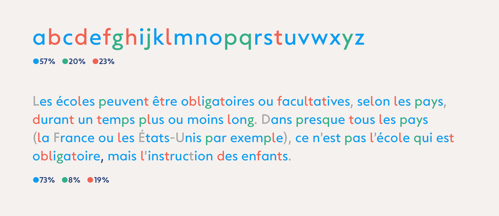
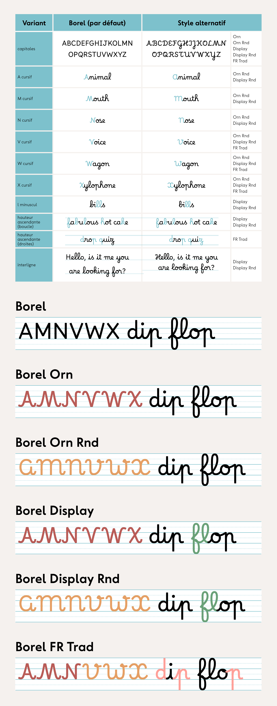

### Find the english version of this documentation here: [Borel, a typographic system for primary school](./README_en.md).

## Tutoriels
- [Télécharger les polices](./documentation/README.md#télécharger-les-polices)
- [Installer les polices](./documentation/README.md#installer-les-polices)
- [Que faire si les lettres ne se connectent pas](./documentation/README.md#activer-les-alternatives-contextuelles)
- [Utiliser Borel et Borel Guides ensemble](./documentation/README.md#utiliser-de-borel-et-borel-guide-ensemble)

# Borel, une police cursive pour l’école primaire

### Apprendre à lire, apprendre à écrire

Comment penser la typographie pour l’apprentissage conjoint de la lecture et de l’écriture? Initié en 2017 à l’ANRT (Atelier National de Recherche Typographique), ce projet a été développé en collaboration avec des enseignants et des orthophonistes, dans le but de remettre en question certaines conventions typographiques du système éducatif, tout en proposant des solutions adaptées et respectueuses des pratiques pédagogiques.

Le style cursif traditionnel enseigné à l’école primaire en France présente un rapport de proportion élevé entre les ascendantes et la hauteur d’x, ce qui nuit à la lisibilité des écrits tels que présentés en classe. Cela peut constituer un obstacle pour l’ensemble des lecteurs débutants, et en particulier pour ceux ayant des troubles des apprentissages. Ainsi, *Borel* vise à harmoniser les tracés cursifs avec des structures typographiques plus communes, reconnues pour favoriser la lisibilité. Cette police, nommée en hommage à Suzanne Borel-Maisonny (pionnière française de l’orthophonie), adopte un dessin robuste, à faible contraste et à hauteur d’x généreuse. Les lettres sont volontairement ouvertes et facilement différenciables, tout en respectant les conventions de l’écriture scolaire française.

La police est "open-source" (libre) et disponible sur Google Fonts: [https://fonts.google.com/specimen/Borel](https://fonts.google.com/specimen/Borel). Cela veut dire qu’elle est accessible à tous, gratuitement, dans des conditions d’utilisation absolument minimales: 
- La police peut-être utilisée dans n’importe quel cadre (pédagogique, personnel, commercial…).
- Il est possible de modifier la police et de la réexporter, à partir du moment où la modification est elle-même open-source, gratuite et l’auteure originale (Rosalie Wagner) créditée.
- Il est interdit de vendre la police ainsi que tous ses dérivés.

**Les enseignants sont invités à faire leur retour d’utilisation du Borel après avoir expérimenté avec leur élèves.** 

Pour l’instant il n’existe pas (ou alors très peu) d’étude expérimentale spécifique à la lisibilité des polices cursives dans le contexte de l’apprentissage de la lecture. Les chercheurs intéressés sont invités à contacter Rosalie Wagner (mail@rosaliewagner.com) s’ils veulent collaborer pour la production d’un matériel expérimental adapté à une telle démarche.

### Lexique

Les termes typographiques sont nombreux, mais il est important pour l’adulte de les connaitre pour comprendre le projet Borel et la suite de cette documentation.

*Termes typographiques traditionnels.*

Pour les enfants, on peut simplifier en parlant de « zones ». Cela amène plus de liberté dans l’exercice d’écriture et c’est aussi plus logique par rapport aux différentes tailles des ascendantes qu’on retrouve conventionnellement en typographie. 

*Termes simplifiés adaptés aux enfants.*

### L'écriture cursive à la française

On pourrait croire qu’à l’ère numérique, l’enseignement de l’écriture cursif serait devenu obsolète. Pourtant de récentes études[^1] ont démontré l’opposé:

- Le style cursif, en plus de favoriser de meilleures compétences en écriture, semble plus facile à apprendre pour les jeunes enfants à l’école primaire.
- Le développement des compétences rédactionnelles scolaires (orthographe, grammaire, aisance à l’écrit) pourrait être efficacement soutenu par des stratégies d’apprentissage centrées sur l’écriture cursive.
- Les enfants ayant appris à écrire exclusivement en cursive présentent de meilleurs résultats en orthographe et en syntaxe. Il n’est donc pas recommandé d’enseigner les lettres minuscules romaines, que ce soit comme forme principale ou comme étape préalable à l’introduction de l’écriture cursive.

L’écriture manuscrite enseignée dans les écoles primaires françaises reste donc pertinente, mais elle n’est pas exempte de travers qu’il convient d’analyser, voire de corriger.

Voici un exemple typique d’écriture cursive française, tracée par un enseignant.

*“Affichage alphabet 4 écritures”, [blog d’Estelle](https://estelledocs.eklablog.com/affichage-alphabet-4-ecritures-a112643642), 2014. Un blog d’enseignant parmi tant d’autres, proposant des ressources pédagogiques artisanales.*

Ce style présente plusieurs caractéristiques:

- **Les ascendantes sont trois fois plus grandes que la hauteur d'x**, ce qui est nettement plus élevé que ce que l’on observe dans des environnements typographiques plus communs (livres, écrans, signalétique, etc.), et surtout au regard de ce que l’on sait en matière de lisibilité.

- **Les lettres capitales adoptent souvent le style cursif**, bien que cela ne soit plus recommandé. En effet, elles peuvent poser des difficultés aux jeunes scripteurs puisqu’elles sont difficiles à tracer et certaines formes de lettres peuvent prêter à confusion.

- **L’angle des lettres est droit**, ce qui est particulièrement bénéfique pour les élèves gauchers. Si certains enfants éprouvent des difficultés à maintenir cet angle, ils peuvent incliner leur feuille pour plus de confort.

- **Le style suit une esthétique arrondie.**

- **Certaines lettres (comme le 'b', 'f', 'r', 's', 'x', 'z' et 'Z') présentent des formes “localisée”**, différentes de celles que l’on rencontre dans d’autres pays.

- **Les lignes “Séyès” déterminent les proportions des lettres**, les minuscules occupant une ligne, les ascendantes s’étendant sur trois, etc.

### Un problème de taille

Le principal problème que le projet *Borel* cherche à résoudre est le rapport 1/3 entre la hauteur des ascendantes et la hauteur d’x. En effet, la taille des lettres est souvent contrainte par les lignes du cahier, ce qui signifie que la hauteur d’x est comprimée entre deux lignes, mesurant généralement 1,5 à 2 millimètres.

Ces proportions sont héritées de l’usage de la réglure Séyès d'une part, et d’un style calligraphique populaire du XIXe siècle où les stylos à réservoir étaient largement utilisés d'autre part.

*“Cahier d’écolier de René Courteaux de 1906”, [https://fragments-histoires.com](https://fragments-histoires.com/Cahier-d-ecolier-de-Rene-Courteux.html?id_document=2014#documents_portfolio)*

Cependant, plusieurs arguments nous invitent à remettre en question ces conventions :

**La lisibilité des mots est fortement influencée par la hauteur des « petites lettres ».**  En effet, Les lettres comprises entre la ligne de base et la hauteur d’x représentent environ 60 % de notre alphabet, et elles sont aussi les plus fréquentes en français (environ 80 %).[^2] Il paraît donc peu logique d’accorder une attention disproportionné aux majuscules et aux ascendantes/descendantes, et ce au détriment des petites lettres.

  
*Distribution des lettres dans un alphabet latin de base en fonction de leur hauteur.*

**Il y a un rapport direct entre taille de corps d'un teste et sa lisibité. Aussi, la taille perçue d’une police peut sembler plus grande ou plus petite selon le rapport entre la hauteur d’x et la hauteur des ascendantes.** Par exemple, lorsqu’on utilise *Times New Roman* ou *Arial* en taille 12 pt, *Arial* paraîtra plus lisible en raison de sa hauteur d’x plus grande.[^3]  

*Comparaison de la hauteur d'x entre Arial et Times New Roman.*

**Lorsqu’un lecteur entrainé adulte lit un texte continu à une distance standard de 40 cm, une hauteur d’x comprise entre 1,5 mm et 14 mm est nécessaire pour garantir une bonne lisibilité.[^4]** Ainsi, 1,5 mm constitue le seuil minimal de lisibilité pour un lecteur entrainé. En outre, plusieurs études indiquent que les lecteurs débutants — en particulier ceux présentant une dyslexie — bénéficient d’un plus grand corps de texte.  

**En effet, les enfants en école primaire présentent une meilleure vitesse de lecture et de compréhension lorsque la hauteur d’x avoisine 5 mm.[^5]** Dans les livres pour enfants, la hauteur d’x varie généralement de 4 mm (pour les enfants de 5 ans) à 2 mm (pour ceux de 11 ans). Il a été observé dans un premier temps que les enfants de moins de 10 ans lisaient plus rapidement avec la taille de caractère destinée aux enfants de 5 ans. Sur cette base, une étude a testé des enfants de 7 à 8 ans avec la police *Arial* allant de 22 pt (4,2 mm) à 26 pt (5 mm): les résultats ont montré que la vitesse de lecture atteignait son maximum lorsque la hauteur d’x était de 5 mm, et ce sans nuire à la compréhension, comme le montre une étude de vérification.[^6]

Malheureusement, les polices couramment utilisées par les enseignants ne peuvent pas être agrandies sans aller au delà des lignes Séyès.

  
*“Dumont Maternelle” de Danièle Dumont est une police très utilisée par les enseignants. Malgré la qualité évidente du dessin, les proportions tradionnelles empêchent toute mise à l’échelle vers une taille de lecture plus confortable.*

La police *Dumont Maternelle* de Danièle Dumont est l’une des rares polices destinées à l’école élémentaire qui soit réellement bien dessinée et recommandée par les instances officielles de l’Éducation nationale.   C’est pourquoi elle est utilisée ici à titre d’exemple — toute autre police n’aurait pas permis une comparaison sérieuse.

**Un interligne équilibré est également essentiel pour éviter les collisions entre ascendantes et descendantes d’une ligne à l’autre.** En effet, un interlignage trop serré ou trop espacé peut nuire à la lisibilité.[^7]  
Les polices cursives traditionnelles calées sur les lignes de cahier donnent souvent un rendu visuel trop encombré, tandis que le saut d’une ligne crée une impression d’espacement excessif.

  
*Les proportions conventionnelles empêchent également une bonne composition des paragraphes: l’interlignage est soit trop réduit, soit trop large.*

**Ces proportions ne sont rarement, voire jamais, observées à l’étranger.[^8]** Cela montre qu’il n’existe pas de norme universelle, et qu’il y a peu de raisons de perpétuer un système aussi rigide.

 *[TypeTogether](https://www.type-together.com) a mené une recherche sur les modèles d’écriture scolaire utilisés dans le monde et a identifié (à ce jour) 68 modèles différents dans 40 pays. Voir [primarium.info](https://primarium.info)*

Néanmoins, lors de l’apprentissage de l’écriture, il est essentiel d’entraîner les doigts et les yeux à distinguer les petites lettres des grandes. Atteindre une taille permettant le développement de la motricité fine — passer de petites boucles à de plus grandes, à l’aide des seuls doigts et non de la main entière — est fondamental.[^9] Il est donc nécessaire de marquer clairement la différence entre hauteur d’x et hauteur des ascendantes, sans pour autant compromettre excessivement la lisibilité.

Par ailleurs, il est pratiquement impossible de s’affranchir des lignes Séyès — qui sont présentent dans la grande majorité des cahiers scolaires. Cela impose une analyse critique des normes d’écriture cursive, tout en tenant compte de cette contrainte incontournable.

**Au-delà de ces proportions, d’autres éléments typographiques influencent la lisibilité, en particulier à une courte distance de lecture.** Les travaux de recherche de Sofie Beier donnent des instructions claires à ce sujet. Par exemple, une graisse plus épaisse[^10], une chasse plus large[^11] (ou du moins non-étroite), ainsi que des pleins et déliés peu contrastés[^12], peuvent contribuer à une meilleure compréhension et vitesse de lecture.

On peut aussi noter que les polices cursives traditionnelles présentent souvent une épaisseur de tracé très fine. Cela s’explique en partie par la volonté d’imiter le rendu du stylo-bille, mais aussi par des contraintes de design: épaissir le trait dans un espace aussi réduit pourrait nuire à la reconnaissance des lettres en petit corps. Cela souligne l’importance d’augmenter la taille des lettres pour permettre une graisse plus forte.

**Enfin, un problème de design fréquent perturbe le rythme naturel de l'écriture.** Dans un souci de simplification du processus de dessin numérique, le point de jonction entre les lettres se fait à la même hauteur, ce qui les oblige à se connecter dans un angle diagonal identique. Si cela rend les connexions uniformes — donc plus faciles à réaliser pour le designer — cela donne un aspect rigide, voire même trop régulier. Connecter les lettres au même niveau peut aussi provoquer des confusions de formes: par exemple, un 'o' peut ressembler à un 'a' si le point de jonction est trop bas.

  
*De haut en bas : Écriture A (par Malou Verlomme, Laurence Bedoin, Marion Andrews), Gaston (par Jean Boyault) et Écolier (par JM Douteau).*

C’est le cas de ces polices libres. L’*Écriture A*, commandée par le Ministère de l’Éducation nationale et conçue par des professionnels de la typographie, est très élégante mais a été développée sans consulter les enseignants du primaire ni la recherche sur le sujet. En conséquence, elle ne reflète pas lestyle arrondie conventionnelle et ne suit pas la réglure Séyès, ce qui limite son utilisation par les enseignants. *Gaston* et *Écolier*, en revanche, ont été créées par des designers amateurs. Bien que plutôt mal dessinées (il faut l'admettre), elles sont largement utilisées par les enseignants car elles se rapprochent davantage des formes traditionnelles que ces derniers ont eux-mêmes apprises à l'école. Au final, aucune de ces polices ne répond vraiment aux besoins des enfants apprenant à lire et écrire.

Pour qu’un mot soit facilement déchiffrable, il est essentiel que les lettres restent clairement différenciables au sein de celui-ci. La rigidité des connexions uniformes tend à homogénéiser les formes des mots — surtout en petit corps — et ne reflète pas le rythme naturel de l’écriture manuscrite. C’est souvent pour cette raison que les enseignants préfèrent utiliser des modèles faits main: les lettres se connectent à des hauteurs et angles variables, ce qui permet un flux plus naturel et aide mieux à guider la main de l’enfant.

## La conception du Borel

La conception du *Borel* a d’abord eu lieu durant un programme de recherche de 18 mois à l’[ANRT](https://anrt-nancy.fr/en). Le projet a été lancé en parallèle d’une analyse approfondie des recherches disponibles en 2018 sur la lisibilité, la dyslexie, ainsi que sur le processus d’apprentissage de la lecture et de l’écriture. Tout au long de la conception, des professionnels des domaines de l’orthophonie et de l’éducation ont été consultés.

Le projet *Borel* relève le défi de trouver le bon équilibre entre la hauteur d’x et la hauteur des ascendantes afin d’atteindre :

- Une lisibilité sans contraintes inutiles[^13]  
- Un décodage clair des graphèmes  
- Le développement de compétences avancées en écriture manuscrite  
- Une adaptation aux lignes des cahiers scolaires  

Ainsi, la hauteur d’x de *Borel* correspond à la moitié de la hauteur des ascendantes. Cet ajustement permet de porter la hauteur d’x à 2 lignes et les ascendantes à 4 lignes, offrant ainsi suffisamment d’espace pour épaissir la graisse sans altérer la lisibilité des lettres, ansi que d’obtenir un interlignage plus équilibré.

*Borel offre un interlignage raisonnable.*

Le dessin respecte le style cursif traditionnel, avec un style arrondie et des connexions fluides. L'inclinaison strictement verticale des lettres profite également aux enfants gauchers, rendant l’écriture plus accessible. De plus, les courbes des lettres et les jonctions suivent des dynamiques distinctes, ce qui aide distinguer les lettres au sein d'un même mot.

*Borel présente un angle d’inclinaison droit et des connexions arrondies.*

Avec quatre variantes de positionnement et quatre types de jonctions, le système comprend dix formes alternatives pour chaque lettres, permettant une écriture fluide, proche du naturel.

*Chaque lettre existe en 10 variantes.*

Chaque lettre a fait l’objet d’une étude minutieuse afin d’assurer un guidage clair et univoque de l’écriture. L’objectif principal était de respecter un ductus simple tout en étant adapté aux besoins des enfants en plein développement de leur motricité fine.

Considérons l’évolution de la lettre 'a' dans l’écriture d’un élève au fil de sa progression. Selon les instructions reçues, la forme de la lettre peut parfois devenir source de confusion lorsque l’élève écrira plus rapidement. 

*Comment les instructions d’écriture peuvent influencer les compétences futures.*

**Les capitales par défaut sont romaines et non cursives.**  
Traditionnellement, une police cursive comprend un jeu de lettres capitales elles-mêmes cursives. Cependant, ces capitales cursives privilégient uniquement la cohérence esthétique et négligent l’aspect pédagogique :

- **Elles ont des formes compliquées** qui peuvent induire en erreur (par exemple 'S', 'T', 'C'), surtout pour les enfants en difficulté d’apprentissage.  
- **Elles ne correspondent pas à des modèles calligraphiques logiques**.  
- **Elles ajoutent un modèle supplémentaire à apprendre.** Les enfants doivent déjà apprendre à lire les majuscules et minuscules typographiques; ils apprennent aussi à écrire les minuscules cursives et les majuscules imprimées. Ajouter une version différente de capitale cursive semble superflu, d’autant plus que les élèves abandonnent naturellement les capitales cursives en grandissant.  

Les capitales romaines, quant à elles, sont introduites dès la maternelle pour des raisons pertinentes:

- **Elles sont simples.** Tracer des capitales imprimées ne nécessite que la capacité de réaliser des lignes droites (horizontales, verticales, diagonales) et des cercles (entiers, demi, ouverts) — exception faite du S. Ces formes font partie du développement moteur en maternelle, il n’y a donc pas besoin d’un programme spécifique pour apprendre les capitales.  
- **Elles sont cohérentes.** quelle que soit la police choisie ou la langue latine utilisée, leur structure reste globalement constante.

Ainsi, d’un point de vue pédagogique, il est plus pertinent de conserver les capitales romaines dans la police *Borel* par défaut.

## Les différents styles de Borel

Pour répondre aux besoins de plusieurs acteurs — tels que des enseignants plus traditionnels ou des éditeurs moins conventionnels — *Borel* est proposée en plusieurs styles.

|                    | Borel | Borel Orn | Borel Orn Round | Borel Display | Borel Display Round | Borel FR Traditional |
|--------------------|-------|-----------|-----------------|---------------|---------------------|----------------------
| capitales romaines |   X   |           |                 |               |                     |                      |
| capitales cursives |       |     X     |        X        |       X       |          X          |            X         |
|  A cursif          |       |    /\     |       ()        |      /\       |         ()          |           /\         |
|  M cursif          |       |    /\     |       ()        |      /\       |         ()          |           /\         |
|  N cursif          |       |    /\     |       ()        |      /\       |         ()          |           /\         |
|  V cursif          |       |    /\     |       ()        |      /\       |         ()          |           ()         |
|  W cursif          |       |    /\     |       ()        |      /\       |         ()          |           ()         |
|  X cursif          |       |    /\     |       ()        |      /\       |         ()          |           ()         |
|  l symétrique      |       |           |                 |       X       |          X          |                      |
| boucle ascendantes |  200% |    200%   |      200%       |      190%     |         190%        |         200%         |
| ascendantes droites|  175% |    175%   |      175%       |      175%     |         175%        |         200%         |
| Interline          |  200% |    200%   |      200%       |      150%     |         150%        |         200%         |

 

*Les différents styles disponibles du Borel.*

### Notes

[^1]: Semeraro C, Coppola G, Cassibba R, Lucangeli D (2019) *Teaching of cursive writing in the first year of primary school: Effect on reading and writing skills.* Plos One .14. 2. doi: [10.1371/journal.pone.0209978](https://doi.org/10.1371/journal.pone.0209978).

[^2]: En 2008, l'université de Toulouse a recensé [la fréquence des lettre dans tout le Wikipedia français](https://fr.wikipedia.org/wiki/Fréquence_d%27apparition_des_lettres)).

[^3]: Legge GE, Bigelow CA. (2011) *Does print size matter for reading? A review of findings from vision science and typography*. Journal of Vision. 11. 8. doi: [10.1167/11.5.8.](https://doi.org/10.1167/11.5.8)

[^4]: Legge GE, Bigelow CA, *op. cit.*

[^5]: Hughes, Laura & Wilkins, Arnold. (2000). *Typography in children’s reading schemes may be suboptimal: Evidence from measures of reading rate.* Journal of Research in Reading. 23. 314–324. doi: [10.1111/1467–9817.00126.](https://doi.org/10.1111/1467-9817.00126)

[^6]: Wilkins, Arnold & Cleave, Roanna & Grayson, Nicola & Wilson, Louise. (2009). *Typography for children may be inappropriately designed.* Journal of Research in Reading. 32. 402–412. doi: [10.1111/j.1467–9817.2009.01402.x.](https://doi.org/10.1111/j.1467-9817.2009.01402.x)

[^7]: Virginia Klein. (2010). *Influence de la typographie sur l’aisance de lecture d’une population d’enfants dyslexiques.* Université Bordeaux Segalen — Bordeaux 2. Sciences cognitives. HAL id: [dumas-01302521f](https://dumas.ccsd.cnrs.fr/dumas-01302521v1).

[^8]: TypeTogether a entrepris une recherche globale sur les écritures scolaires du monde: *[primarium.info](https://primarium.info).*

[^9]: Danièle Dumont. (2016). *Le geste d’écriture, Méthode d’apprentissage Cycle 1 • Cycle 2, Différenciation et transversalité.* Hatier.

[^10]: Beier, Sofie & Oderkerk, Chiron. (2019). *Smaller visual angles show greater benefit of letter boldness than larger visual angles.* Acta Psychologica. 199. doi: [102904. 10.1016/j.actpsy.2019.102904.](https://www.sciencedirect.com/science/article/pii/S000169181830581X?via%3Dihub)

[^11]: Oderkerk, C. A. T., & Beier, S. (2021). *Fonts of wider letter shapes improve letter recognition in parafovea and periphery.* Ergonomics, 65 (5), 753–761. doi: [10.1080/00140139.2021.1991001](https://www.tandfonline.com/doi/full/10.1080/00140139.2021.1991001)

[^12]: Minakata, Katsumi & Eckmann-Hansen, Christina & Larsen, Michael & Bek, Toke & Beier, Sofie. (2023). *The effect of serifs and stroke contrast on low vision reading.* Acta Psychologica. 232. doi: [103810. 10.1016/j.actpsy.2022.103810.](https://www.sciencedirect.com/science/article/pii/S0001691822003250?via%3Dihub)

[^13]: Pour plus d'informations sur le sujet de la lisibilité en typographie: Mary C. Dyson. (2023). *How and why typography affects ease of reading.* [legible-typography.com/en/](https://legible-typography.com/en/).

