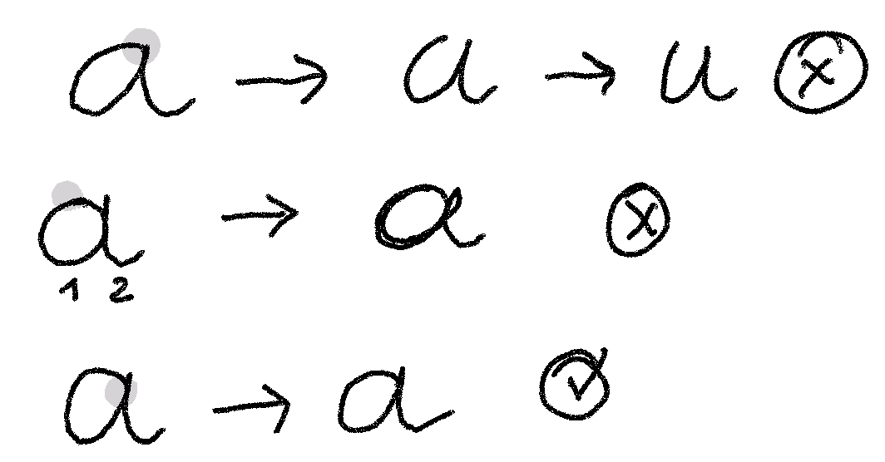

# Borel, un système typographique pour l'école primaire.

### Find the english version of this documentation here: [Borel, a typographic system for primary school](./README_en.md).

## Apprendre à lire, apprendre à écrire

Comment penser la typographie pour l’apprentissage conjoint de la lecture et de l’écriture? Développé avec des enseignants du primaire et des orthophonistes, ce projet cherche à harmoniser, dans la mesure du possible, les signes que l'on apprend à lire et ceux que l’on apprend à écrire. 

Un système typographique a donc été pensé dans cette logique, pour établir une continuité entre tracé cursif et forme typographique. **Borel** (nommé en hommage à Suzanne Borel-Maisonny, pionnière de l’orthophonie) est un caractère robuste, peu contrasté, avec une grande hauteur d'x. Les lettres sont ouvertes et bien distinctes, tout en respectant les règles de l’écriture dans les écoles françaises. **Borel Guides**, qui permet d'afficher des lignes de cahier, vient compléter ce système qui met en valeur l'accessibilité, l'adaptabilité et la cohérence.

**Les enseignants sont invités à faire leur retour d'utilisation de Borel après avoir expérimenté avec leur élèves.** 

Pour l'instant il n'existe pas (ou alors très peu) d'étude expérimentale spécifique à la lisibilité des polices cursives dans le contexte de l'apprentissage de la lecture. Les chercheurs intéressés sont invités à contacter Rosalie Wagner s'ils veulent collaborer pour la production d'un matériel expérimental adapté à une telle démarche.

## Tutoriels
- [Télécharger les polices](./documentation/README.md#télécharger-les-polices)
- [Installer les polices](./documentation/README.md#installer-les-polices)
- [Que faire si les lettres ne se connectent pas](./documentation/README.md#activer-les-alternatives-contextuelles)
- [Utiliser Borel et Borel Guides ensemble](./documentation/README.md#utiliser-de-borel-et-borel-guide-ensemble)

## Lexique
Les termes typographiques sont nombreux, mais il est important pour l'adulte de les connaitre pour comprendre le projet Borel et la suite de cette documentation.

Pour les enfants, on peut simplifier en parlant de « zones ». Cela amène plus de liberté dans l’exercice d’écriture et c’est aussi plus logique par rapport aux différentes tailles des ascendantes qu'on retrouve conventionnellement en typographie. 

## Proportions

Les polices cursives scolaires traditionnelles sont disprortionnées par rapport au polices d'écriture de l'usage courant — que l'on retrouve dans les livres, sur les écrans ou la signalétique. Si on regarde les cursives scolaires en France, les ascendantes seraient censées faire trois fois la taille de la hauteur d'x. Sachant que la taille des lettres est souvent limitée aux lignes du cahier, cela veut dire que la hauteur d'x est écrasée entre deux lignes qui, le plus souvent, font 1.5 ou 2mm de hauteur. Ces proportions sont héritées de l'utilisation conjointe des fameuses réglures Séyès et d'un style calligraphique propres à l'utilisation des plumes à réservoir des siècles précédents. 

Hors il y a plusieurs arguments qui nous poussent à questionner ces canons:

1. C'est la hauteur de la "zone des petites lettres" qui va conditionner la lisibilité du mot. En effet, les lettres qui sont contenues entre la ligne de base et la hauteur d'x constituent environ 65% de notre alphabet (sans compter les lettres accentuées), en plus de cumuler la plus grande fréquence d'apparition dans le français (environ 80%).[^1] Il parait donc absurde de donner autant d'importance aux capitales, ainsi qu'aux ascendantes/descendantes. 

2. La taille perçue d'une police va paraitre plus ou moins grande en fonction du rapport entre hauteur d'x et hauteur d'ascendante. Par exemple, lorsque *Times New Roman* ou *Arial* sont composé en corps 12pt, *Arial* paraitra plus grande car sa hauteur d'x est plus haute.[^2] Pour compenser la perte de lisibilité d'une police cursive qui a une hauteur d'ascendante 3 fois plus grande que la hauteur d'x, il faudra donc augmenter la taille globale de la police. Malheureusement, peu d'enseignants le font, et c'est aussi impossible lorsque les réglures Séyès dictent la composition du texte.

3. Il faudra aussi un interlignage plus grand pour éviter que les ascendantes et les descendantes ne s'entrechoquent d'une ligne à l'autre. Hors, un interlignage trop serré ou trop grand peut impacter négativement la lisibilité.[^3] Lorsque les polices cursives traditionnelles suivent les lignes du cahier, l'interlignage parait trop serré, et lorsque l'on saute une ligne, il parait trop large.

4. Pour la lecture continue d'un texte à une distance standard de 40cm, par un adulte normolecteur, la hauteur d'x devrait se trouver entre 1.5mm et 14mm pour rester lisible.[^4] 1.5mm est la taille minimum sur le spectre de la lisibilité pour un adulte ! Des études ont démontré que les apprentis lecteurs, et particulièrement ceux présentant des troubles dys, bénéficiaient à lire des caractères légèrement plus grands.[^5] L'étude retenue pour soutenir cette thèse fait le cas de Times New Roman donnant de meilleurs resultats de lecture à 18pt jusqu'à la fin du CE1; cela correspond à une hauteur d'x de 2.84mm (ce qui correspond à Borel en 16pt). Ces chiffres ne sont bien sûr pas absolus et généraux à tous les enfants, mais ça donne une idée.

5. Ces proportions (Hauteur d'x = 1/3 Ascendante) sont observées en France mais rarement, voire jamais, à l'étranger.[^6] C'est bien la preuve qu'il n'y a donc pas qu'une manière de faire, et qu'il y a peu de raison à perpétuer un système aussi rigide.

Cela-dit, lors de l'apprentissage de l'écriture, il est important d'entrainer les doigts et les yeux à bien faire la différence entre les petites et les grandes lettres. Il faut arriver à une taille qui permette d'exercer la motricité fine — passer de petites boucles à grande boucles en ne bougeant que les doigts, pas les mains. Il faut donc une claire différence entre hauteur d'x et ascendante, sans pour autant exagérer cette différence au risque d'impacter négativement la lisibilité. De plus, il est pratiquement impossible dans l'enseignement en France de s'abstraire des cahiers d'écriture à réglure Séyès; il faut donc questionner les canons de l'écriture scolaire cursive, sans pour autant passer outre ce facteur.

**Le défi que doit donc relever le projet Borel est celui du juste compromis entre hauteur d'x et ascendante pour permettre:** 
- une lisibilité non contraignante[^7]
- la clarté du déchiffraphe des graphèmes
- l'entrainement au geste d'écriture[^8]
- l'adaptation aux lignes du cahier

J'ai donc adapté les proportions de Borel afin que la hauteur d'x corresponde à deux lignes du cahier, et que la hauteur des grandes boucles corresponde à quatre. Ainsi les proportions sont plus harmonieuses avec les caractères romains conventionnels.

**Pourquoi les capitales sont-elles plus petites que les grandes boucles?** 

Conventionnellement, la hauteur des capitales est la même que la hauteur des ascendantes, ou légèrement plus petite. Ceci dans le cas où les ascendantes sont droites comme dans n'importe quelle Serif (ex. Times New Roman), ou Sans-Serif (ex: Arial, Comic Sans). Dans l'écriture cursive en France, nous utilisons la boucle pour joindre l'ascendante par le haut; l'amplitude de la boucle augmente la hauteur de l'ascendante. Mais les lettres comme `t`, `d`, `q`, ainsi que les capitales qui ne bénéficient pas de cette jonction, sont donc plus petites que les grandes boucles.

**Pourquoi les capitales ne sont-elles pas cursives?** 

Traditionnellement, une fonte cursive présente un modèle de capitales qui est lui-même cursif. Seulement ces capitales cursives ne supportent qu'une cohérence esthétique et oublie l'aspect pédagogique:

- Elles ont des formes compliquées qui prêtent à confusion (par exemple. S, T, C), particulièrement pour les enfants présentant des troubles des apprentissages.
- Elles ne correspondent pas à des modèles de calligraphie logique par rapport au geste ou à l'outil d'écriture.
- Elles représentent un modèle additionnel à apprendre. Les enfants doivent déjà apprendre à lire les versions capitales et minuscules typographique d'une lettre, ils doivent en plus apprendre à écrire cette même lettre dans une forme légèrement différente dans sa forme cursive. Il ne semble donc pas nécessaire d'alourdir l'apprentissage en ajoutant la version capitale cursive qui de plus est naturellement abandonnée par l'étudiant lorsqu'il grandit.
- D'un pays à l'autre, les modèles de capitales cursives diffèrent considérablement.

Les capitales typographiques (dites "bâton"), en revanche, sont celles initialement introduites en maternelle[^8] pour des raisons pertinentes:

- Elles sont simples. Former les capitales typographiques nécessite seulement de savoir faire des traits droits (horizontaux, verticaux, obliques) et des ronds (entier, semi, ouverts) —à l'exception seul du S qui sort un peu du lot. Ces formes font partie des apprentissages moteurs en maternelle et il n'est donc pas nécessaire d'ajouter un programme spécifique au dessin les capitales.  
- Elles sont immuables. Qu'elle que soit la police choisie ou la langue latine, leur structure reste globalement constante.

Il est donc plus intéressant d'un point de vu pédagogique de garder les capitales typographie dans la police Borel. Cela-dit, une prochaine version proposera des formes cursives simplifiées afin d'amener une esthétique cohérente à la police. Cette version sera destinée aux enfants qui ont une appétence particulière pour l'exercice d'écriture ou de calligraphie, ou encore pour les entreprises et éditeurs qui utilisent la police en dehors du contexte pédagogique.

**Pourquoi enseigner l'écriture cursive en maternelle et primaire?**

Certains pensent qu'en plein ère numérique il n'est plus nécessaire d'enseigner l'écriture cursive. Pourtant de nombreuses études démontrent le contraire:[^9]

- Le style cursif, en plus d'être prédictif de meilleures compétences en écriture, semble plus facile à apprendre pour les jeunes enfants à l'école primaire.
- Le développement des compétences en matière d'écriture académique (orthographie, grammaire, aisance d'écriture) pourrait être efficacement soutenu par des stratégies de formation axées sur l'écriture cursive.
- Les enfants qui ont appris à écrire uniquement en cursif présentent des performances supérieures en orthographe et en syntaxe. Il n'est donc pas conseillé d'enseigner les minuscules typographiques (que ce soit comme seul enseignement ou en amont de l'introduction aux formes cursives).

## Processus de design
Pour que la police soit un parfait modèle pour l'apprentissage de l'écriture, chaque lettre existe sous forme de 10 variantes contextuelles.

Le design de Borel a commencé après avoir analysé un corpus de recherches sur la lisibilité, la dyslexie et l'apprentissage de la lecture et de l'écriture. Des professionnels dans l'orthophonie et l'enseignement ont été interrogés tout du long, et leurs conseils pris en compte.

Chaque lettre a fait l'objet d'une étude particulière afin de permettre un geste souple, fluide et ininterrompu. Le but était de proposer un ductus simple mais sans équivoque, adapté à un enfant qui développe sa motricité fine.

Voici un exemple de comment le tracé de la lettre `a` peut se développer chez un élève lorsqu'il grandit et écrit de plus en plus vite.

## Borel Guides

Borel Guides est une police pour tracer des lignes de cahier. Elle se superpose parfaitement à la police Borel. Elle contient différentes palettes de couleurs, pour s'ajuster à la préférence des petits écrivains, mais aussi un grand choix de motifs linéaires pour s'adapter à l'objectif pédagogique, à la police utilisée, etc. L'enseignants est aussi libre d'utiliser Borel Guides avec une autre police que Borel, des motifs ont été pensés à cet égard.

Veuillez trouvez toutes les informations sur Borel Guides dans ce document:
**[Borel Guides Instructions](./documentation/proof/BorelGuides-Instructions.pdf)**.

## À venir

À condition de trouver les financements, il est envisagé de developper le projet Borel pour lui permettre de s'adapter encore mieux aux besoins des enseignants et de la recherche.

**Support linguistique:**
- [x] Anglais
- [x] Français / Italien
- [x] Espagnol
- [x] Allemand
- [x] Portugais
- [x] Turque
- [ ] Vietnamien

**Axes de variabilité:**
- [ ] Graisse
- [ ] Chasse
- [ ] Espacement
- [ ] HyperExpansion (chasse + espacement)
- [ ] Oblique

Il pourrait être intéressant de pouvoir faire varier les proportions de la police afin de tester ces différents paramètres:

- [ ] Hauteur des ascendantes
- [ ] Hauteur des capitales
- [ ] Hauteur d'x

**Styles:**
- [ ] Pointillés
- [ ] Contours
- [ ] Guide et flèches

**Alternates:**
- [ ] Capitales cursives simplifiées
- [ ] Capitales cursives ornées

## Bio

[Rosalie Wagner](http://rosaliewagner.com) est diplômée d'un master des Beaux-Arts de Lyon en 2016, et d'un post-master de l'ANRT Nancy (Atelier National de Recherche typographique) en 2019. Elle s'est formée à l'ingénierie de fonte chez Black Foundry (Paris) et Alphabet Type (Berlin). Elle est basée à Berlin et travaille en tant que Type designer et Font engineer indépendante pour Google Fonts depuis 2020. Elle a collaboré avec des foundries comme 205TF, Fontwerk, NaN et Fatype, ainsi que divers designers indépendants et studios de communication.

- **Présentation du projet Borel à l'ANRT**, 2019, [[Video](https://anrt-nancy.fr/fr/videos#video-325200518)]
- **Baskervville**, 2017, [[Google Fonts](https://fonts.google.com/specimen/Baskervville)] — *conception collaborative, design de l'italique, correction et développement du Romain, production de la fonte.*
- **Arima Greek**, 2018, [[Google Fonts](https://fonts.google.com/specimen/Arima?noto.script=Grek&query=Arima&subset=greek)] — *conception et design du grec d'Arima de NDiscover sous la direction d'Emilios Theofanous et Irene Vlachou.*

## License

Ce logiciel de police est soumis à la license SIL Open Font License, Version 1.1.
Cette license est disponible avec une FAQ à l'adresse https://scripts.sil.org/OFL

## Repository Layout

La structure de ce répertoire github est inspiré de l'[Unified Font Repository v0.3](https://github.com/unified-font-repository/Unified-Font-Repository), modifié pour les besoins de Google Fonts.

### Notes

[^1]: L'Université de Toulouse a recensé en 2008 [la fréquence des lettres dans tout le Wikipedia français](https://fr.wikipedia.org/wiki/Fréquence_d%27apparition_des_lettres).

[^2]: *[Does print size matter for reading? A review of findings from vision science and typography](https://jov.arvojournals.org/article.aspx?articleid=2191906#88123043)*, Gordon E. Legge; Charles A. Bigelow, Journal of Vision August 2011, Vol.11, 8. doi:https://doi.org/10.1167/11.5.8

[^3]: *[Influence de la typographie sur l’aisance de lecture d’une population d’enfants dyslexiques. Master Thesis.](https://dumas.ccsd.cnrs.fr/dumas-01302521/document)*, Klein V., Bordeaux : Université de Bordeaux, 2010

[^4]: Gordon E. Legge, Charles A. Bigelow, *op. cit.*

[^5]: Klein V., *op. cit.*

[^6]: Pour plus d'information sur le sujet, TypeTogether a entrepris récemment [une recherche globale sur les écritures scolaires dans le monde](https://primarium.info).

[^7]: Pour plus d'information sur le sujet, *[Legibility, How and why typography affects ease of reading](https://legible-typography.com/en/)*, Mary C. Dyson, [Design Regression](https://designregression.com), 2023 

[^8]: Pour plus d'informations sur le sujet, *[Le geste d'écriture](https://legestedecriture.fr), Méthode d'apprentissage Cycle 1 • Cycle 2, Différenciation et transversalité*, Danièle Dumont, Hatier, 2016

[^9]: Semeraro C, Coppola G, Cassibba R, Lucangeli D. [*Teaching of cursive writing in the first year of primary school: Effect on reading and writing skills.*](https://www.ncbi.nlm.nih.gov/pmc/articles/PMC6366728/) PLoS One. 2019 Feb 7;14(2):e0209978. doi: 10.1371/journal.pone.0209978. PMID: 30730894; PMCID: PMC6366728.
