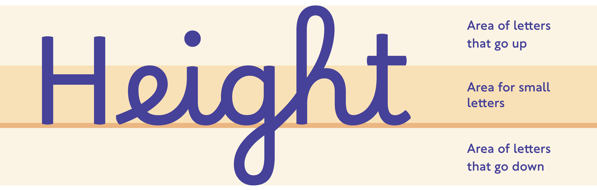
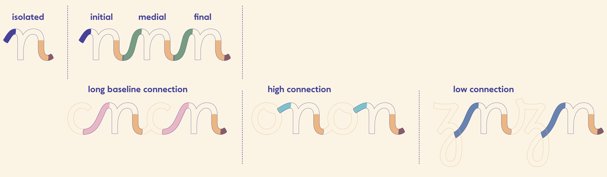
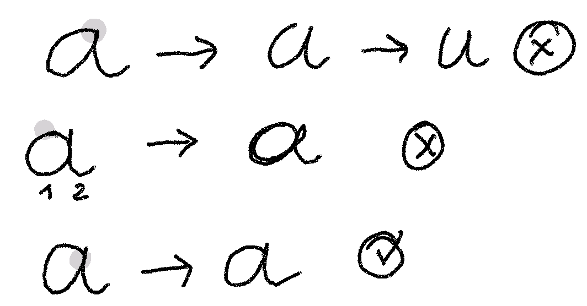

# Borel, a typographic system for primary school.

## Learning to read, learning to write

What considerations should be taken into account when approaching typography in the context of simultaneous learning of reading and writing? Developed with primary school teachers and speech therapists, this project aims to reconnect the signs that we learn to read with those that we learn to write.

The **Borel** project is a typographic toolbox which aims to establish a seamless connection between cursive strokes and common typographic structure. This typeface, named in tribute to Suzanne Borel-Maisonny, a pioneer in speech therapy, boasts a sturdy design featuring low contrast and a generous x-height. The letters are intentionally open and clearly differentiated while adhering to the conventions of writing in French schools. Complementing this system, **Borel Guides** enables the display of notebook lines, further enhancing the emphasis on accessibility, adaptability, and overall coherence.

**Teachers are invited to provide feedback on their use of Borel after experimenting with their students.**

Currently, there is little to no empirical research focusing on the legibility of cursive fonts within the framework of literacy development. Researchers with a interest in this area are encouraged to get in touch with Rosalie Wagner to explore potential collaborations aimed at generating experimental material tailored to this particular approach.

## Tutorials
- [Download the fonts](./documentation/README_en.md#download-the-fonts)
- [Install the fonts](./documentation/README_en.md#install-the-fonts)
- [What to do if the letters do not connect](./documentation/README_en.md#activate-contextual-alternates)
- [Using Borel and Borel Guides together](./documentation/README_en.md#using-borel-and-borel-guide-together)

## Glossary
There are many typographic terms, but it is important for adults to know them in order to understand the Borel project and the rest of this documentation.

To simplify for children, we can use the term "area" instead. This approach provides greater flexibility in writing exercises and aligns more logically with the varying sizes of ascenders commonly observed in typography.

## Proportions

Traditional school cursive fonts are disproportionate compared to the handwriting fonts used in everyday life—those found in books, on screens, or in signage. If we look at the cursive fonts used in French schools, the ascenders are supposed to be three times the size of the x-height. Considering that the size of letters is often limited to the lines of the notebook, this means that the x-height is compressed between two lines, which most often have a height of 1.5 or 2mm. These proportions are inherited from the combined use of the famous Séyès ruling and a calligraphic style specific to the use of reservoir pens from previous centuries.

However, there exist several compelling arguments that prompt us to question these conventions:

1. The readability of words is significantly influenced by the height of the "zone of small letters." Remarkably, the letters encompassed within the baseline and the x-height constitute approximately 65% of our alphabet (excluding accented letters), and they also have the highest frequency of occurrence in French (approximately 80%).[^1] Consequently, attributing excessive significance to uppercase letters and ascenders/descenders appears rather illogical.

2. The perceived size of a typeface can appear larger or smaller depending on the ratio between the x-height and ascender height. For instance, when *Times New Roman* or *Arial* are set in a 12pt font size, *Arial* will appear larger due to its taller x-height.[^2] To compensate for the decreased legibility of a cursive font with ascender height three times greater than the x-height, it is necessary to increase the overall font size. Unfortunately, this practice is rarely adopted by teachers, and it becomes challenging when adhering to the Séyès ruling for text composition.

3. A wider line spacing is also essential to prevent collisions between ascenders and descenders across multiple lines. However, an excessively tight or loose line spacing can negatively affect legibility.[^3] Traditional cursive fonts that align with notebook lines often result in a cramped appearance, while skipping a line can create an overly spacious feel.

4. When reading continuous text at a standard distance of 40cm, adults with normal reading abilities require the x-height to be between 1.5mm and 14mm to ensure readability.[^4] Remarkably, 1.5mm represents the minimum threshold of legibility for adults! Studies have indicated that beginning readers, particularly those with dyslexia, benefit from slightly larger characters.[^5] A study supporting this proposition found that Times New Roman yielded better reading outcomes at 18pt until the end of the first grade, corresponding to an x-height of 2.84mm (equivalent to Borel in 16pt). It is important to note that these figures are not universally applicable to all children but serve as a general guideline.

5. The proportions of x-height and ascender height observed in France (x-height being one-third of the ascender height) are rarely, if ever, found abroad.[^6] This demonstrates that there is not a single standardized approach, and there are limited reasons to perpetuate such a rigid system.

Nevertheless, during the acquisition of writing skills, it is crucial to train fingers and eyes to distinguish between small and large letters. Achieving a size that allows for fine motor skill development—transitioning from small loops to larger ones using only the fingers, not the entire hand—is paramount. Therefore, it is necessary to establish a clear distinction between x-height and ascender height without excessively compromising legibility. Moreover, it is practically impossible to deviate from Séyès ruled writing notebooks in the French education system, necessitating a critical examination of conventional cursive writing norms while still considering this factor.

**Hence, the Borel project faces the challenge of striking the right balance between x-height and ascender height to achieve:**

- Legibility without unnecessary constraints[^7]
- Clear decoding of graphemes
- Development of proficient handwriting skills[^8]
- Adaptation to notebook lines

Consequently, the proportions of Borel have been adjusted so that the x-height corresponds to the height of two notebook lines, while the height of large loops aligns with four lines. This adjustment ensures a more harmonious relationship with conventional Roman characters, and hopefully, a better legibility.

**Why are uppercase letters smaller than large loops?**

Traditionally, uppercase letters have been designed to match the height of ascenders or be slightly smaller. This is the case for serif typefaces (like Times New Roman) or sans-serif typefaces (like Arial and Comic Sans). However, in French cursive writing, a loop is used to connect ascenders from the top, which increases their height. Consequently, letters such as "t", "d", "q", as well as uppercase letters that don't have this connection, appear smaller compared to the expansive large loops.

## Design Process
To create a font that serves as an ideal model for handwriting instruction, each letter in Borel has been crafted in 10 contextual variants.

The design of Borel was initiated following an extensive analysis of research on readability, dyslexia, and the learning process of reading and writing. Throughout the design journey, professionals in the fields of speech therapy and education were involved and their valuable insights were taken into account.

Every individual letter underwent a meticulous study to ensure a seamless, fluid, and uninterrupted writing experience. The primary objective was to create a ductus that was both straightforward and unambiguous, catering to the needs of children as they developed their fine motor skills.

Consider the evolution of the letter 'a' in a student's handwriting as they progress and gain proficiency, gradually transitioning from a learned basic ductus to a potential confusing forms. 

## Borel Guides

Borel Guides is a font specifically designed for creating notebook lines. It perfectly aligns with the Borel font and offers a range of color palettes to suit the preferences of young writers. Additionally, it provides a wide selection of linear patterns to align with specific teaching objectives or font styles. Teachers can also use Borel Guides with fonts other than Borel, as the patterns have been designed with flexibility in mind.

For detailed instructions on using Borel Guides, please refer to the following document:
**[Borel Guides Instructions](./documentation/proof/BorelGuides-Instructions_en.pdf)**.

## Future

Subject to securing funding, there are plans to further develop the Borel project to better cater to the needs of educators and research.

**Variability axes:**
- [ ] Weight
- [ ] Width
- [ ] Spacing
- [ ] HyperExpansion
- [ ] Slant

It would be interesting to be able to vary the proportions of the font in order to test these different parameters:

- [ ] Ascender-height
- [ ] Caps-height
- [ ] x-height

**Styles:**
- [ ] Dotted 
- [ ] Outlined 
- [ ] Guided

**Alternates:**
- [ ] Simplified cursive capitals
- [ ] Swashed capitals

## Bio

[Rosalie Wagner](http://rosaliewagner.com) holds a Master's degree in Fine Arts from Lyon in 2016 and a post-master's degree from ANRT Nancy (National Workshop of Typographic Research) in 2019. She has received training in typeface engineering at Black Foundry (Paris) and Alphabet Type (Berlin). Based in Berlin, she works as an independent Type Designer and Font Engineer for Google Fonts since 2020. She has collaborated with foundries such as 205TF, Fontwerk, NaN, Fatype, as well as various independent designers and communication studios.

- **Presentation of the Borel project at ANRT**, 2019, [[Video](https://anrt-nancy.fr/fr/videos#video-325200518)]
- **Baskervville**, 2017, [[Google Fonts](https://fonts.google.com/specimen/Baskervville)] — *collaborative design, italic design, correction and development of the Roman, font production.*
- **Arima Greek**, 2018, [[Google Fonts](https://fonts.google.com/specimen/Arima?noto.script=Grek&query=Arima&subset=greek)] — *design and Greek adaptation of Arima by NDiscover, under the direction of Emilios Theofanous and Irene Vlachou.*

## License

This Font Software is licensed under the SIL Open Font License, Version 1.1.
This license is available with a FAQ at https://scripts.sil.org/OFL

## Repository Layout

This font repository structure is inspired by [Unified Font Repository v0.3](https://github.com/unified-font-repository/Unified-Font-Repository), modified for the Google Fonts workflow.

### About the translation
This documentation is translated from French with some help from DeepL and ChatGPT4.

### Notes

[^1]: The University of Toulouse compiled in 2008 [the frequency of letters in the entire French Wikipedia](https://fr.wikipedia.org/wiki/Fréquence_d%27apparition_des_lettres).

[^2]: *[Does print size matter for reading? A review of findings from vision science and typography](https://jov.arvojournals.org/article.aspx?articleid=2191906#88123043)*, Gordon E. Legge; Charles A. Bigelow, Journal of Vision August 2011, Vol.11, 8. doi:https://doi.org/10.1167/11.5.8

[^3]: *[Influence de la typographie sur l’aisance de lecture d’une population d’enfants dyslexiques. Master Thesis.](https://dumas.ccsd.cnrs.fr/dumas-01302521/document)*, Klein V., Bordeaux: University of Bordeaux, 2010.

[^4]: Gordon E. Legge, Charles A. Bigelow, *op. cit.*

[^5]: Klein V., *op. cit.*

[^6]: For more information on the subject, TypeTogether has recently undertaken [a global research on school scripts around the world](https://primarium.info).

[^7]: For more information on the subject, *[Legibility, How and why typography affects ease of reading](https://legible-typography.com/en/)*, Mary C. Dyson, [Design Regression](https://designregression.com), 2023.

[^8]: For more information on the subject, *[Le geste d'écriture](https://legestedecriture.fr), Méthode d'apprentissage Cycle 1 • Cycle 2, Différenciation et transversalité*, Danièle Dumont, Hatier, 2016.
