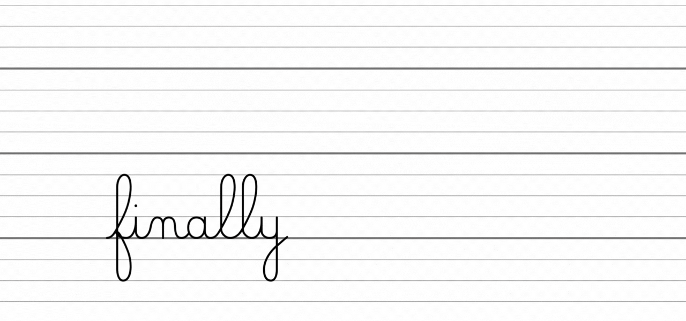
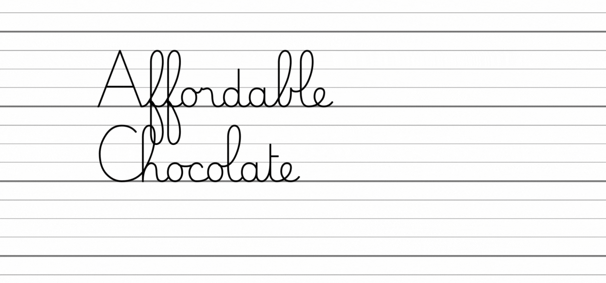
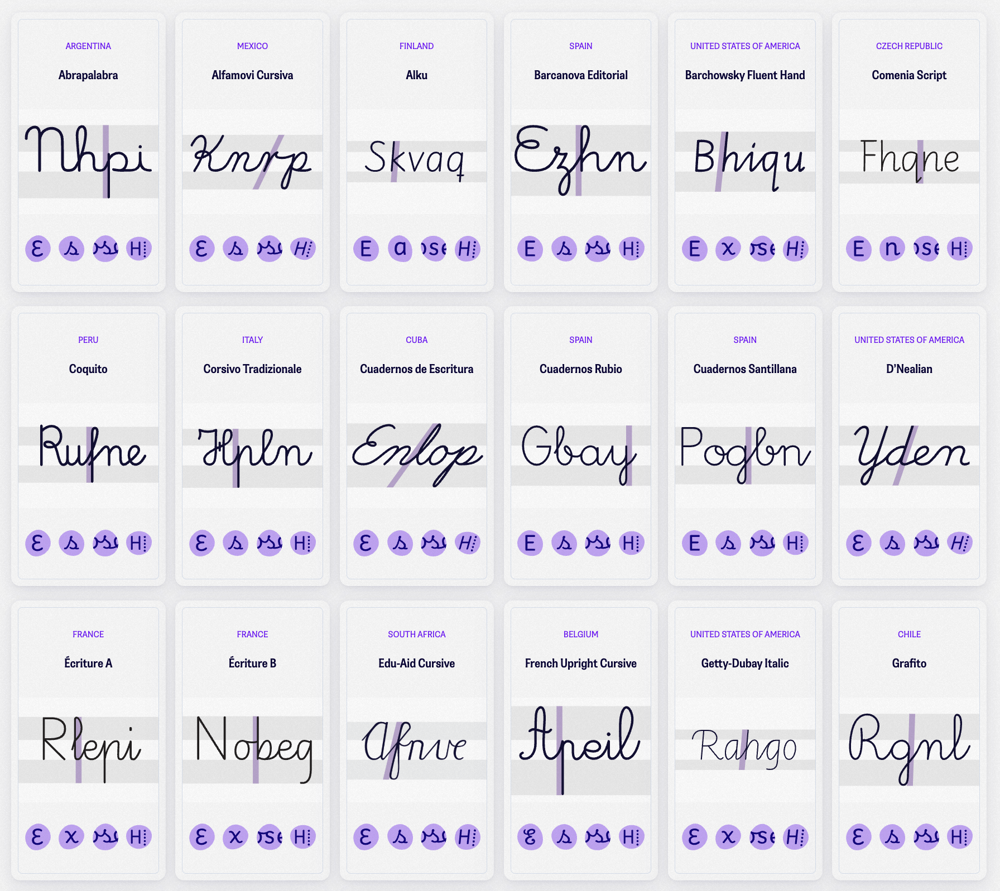
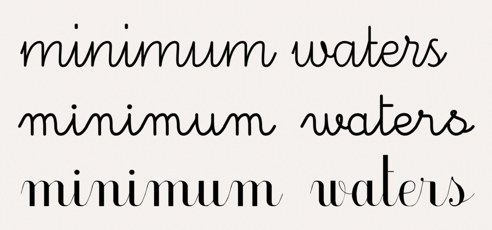
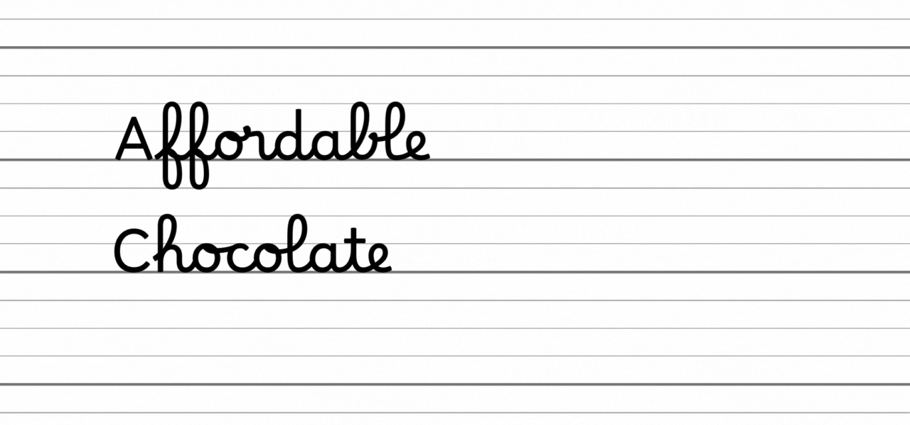

## Tutorials
- [Download the fonts](./documentation/README_en.md#download-the-fonts)
- [Install the fonts](./documentation/README_en.md#install-the-fonts)
- [What to do if the letters appear disconnected](./documentation/README_en.md#activate-contextual-alternates)
- [How to use Borel and Borel Guide together](./documentation/README_en.md#using-borel-and-borel-guide-together)

# Borel, a cursive font for elementary school.

### Learning to read, learning to write

What typographic factors should be considered when teaching reading and writing simultaneously? Initiated in 2017 at the ANRT (research post-master, Nancy, France), this font project was developed in collaboration with teachers and speech therapists, aiming to question educational typographic conventions and explore non-disruptive solutions.

The traditional cursive style taught in French primary schools has an high ascender/x-height ratio, arguing against its legibility at the size of practice. This can pose as a challenge for all beginner readers, particularly those with learning disabilities. Thus, *Borel* aims to harmonise cursive strokes with more common typographic structures that are recognised for enhancing readability. This typeface, named in tribute to Suzanne Borel-Maisonny (a french pioneer in speech therapy), features a robust design with a low contrast and a generous x-height. The letters are intentionally open and clearly differentiated while adhering to the conventions of writing in French schools.

The font is open-source and therefore accessible to all on Google Fonts: [https://fonts.google.com/specimen/Borel](https://fonts.google.com/specimen/Borel), enabling teachers, students, researchers, and publishers to freely use it in their educational materials and beyond.

The documentation also exists in [French](https://github.com/RosaWagner/Borel).

### Glossary

There are many typographic terms, but it is important for adults to know some of them in order to understand the *Borel* project and the rest of this documentation.

*Traditional typographic terms to describe vertical metrics*

To simplify for children, we can use the term “area” instead. This approach provides greater flexibility in writing exercises and aligns more logically with the varying sizes of ascenders commonly observed in typography.

*Simplified terms for children to define typographic zones*

### The French cursive

Some people believe that in the digital age, teaching cursive writing is no longer necessary. However, a recent study[^1] has demonstrated the opposite:

- The cursive style, in addition to predicting better writing skills, appears to be easier for young children to learn in primary school.
- The development of academic writing skills (spelling, grammar, writing fluency) could be effectively supported by training strategies focused on cursive writing.
- Children who have learned to write exclusively in cursive show better performance in spelling and syntax. Therefore, it is not recommended to teach roman typographic lowercase letters at all (either as the sole instruction or as a precursor to introducing cursive forms).

The handwriting taught in French primary schools is therefore still relevant, but it is not without pitfalls to analyse and, if necessary, correct.

This is an example of a typical French cursive handwriting, drawn by a teacher. 

*“Affichage alphabet 4 écritures” (“Display of alphabet in 4 writing styles”) from the [blog of “Estelle”](https://estelledocs.eklablog.com/affichage-alphabet-4-ecritures-a112643642), 2014. One of the numerous teacher’s blog proposing handcrafted educational resources.*

This style exhibits several features:

* **The ascenders are reaching three times the size of the x-height**, which is significantly taller compared to what we see in a more common typographic environment (books, screen, signage etc.), and especially regarding what we know about readability.

* **The capital letters often follow the cursive style**, although it is not recommended anymore since they can be challenging for beginning writers—they are hard to trace and some letter shapes are easily confusable for readers.

* **The script has an upright angle**, which is actually thoughtful for the left handed people. If the upright angle is hard to reproduce for some children, they can rotate their sheet to be more comfortable.

* **It follows a rounded aesthetic.** 

* **Some letters (like 'b', 'f', 'r', 's', 'x', 'z', and 'Z') have unique shapes** that are different from what you might see in other countries. 

* **The “Séyès” lines — a system of guidelines — dictate the proportions of the letters**, with the lowercase letters using one line, ascenders using three lines, and so on.

### An issue of proportion

The main issue that the *Borel* project aims to address is the 1/3 ratio between the ascender height and the x-height. Indeed, the letter size is often confined to the lines of a notebook, which means that the x-height is compressed between two lines, typically measuring 1.5 to 2 millimeters. These proportions are a legacy of the combined use of the Séyès ruling system and a calligraphic style that was popular when reservoir pens were widely used in previous centuries.

*Extract of a student’s schoolbook from the [blog of “Monsieur Mathieu”](https://monsieurmathieu.fr/tag/ecriture), 2023, teacher in elementary school. This is an example of a writing exercice commonly found in 1st grade.*

*“Cahier d’écolier de René Courteaux de 1906” (School book of René Courteaux, 1906), [https://fragments-histoires.com](https://fragments-histoires.com/Cahier-d-ecolier-de-Rene-Courteux.html?id_document=2014#documents_portfolio)*

However, there exist several compelling arguments that prompt us to question these conventions:

**The readability of words is significantly influenced by the height of the “small letters”.** Remarkably, the letters encompassed within the baseline and the x-height constitute approximately 60% of our alphabet, and they also have the highest frequency of occurrence in French (approximately 80%).[^2] Consequently, attributing excessive space to uppercase letters and ascenders/descenders, decreasing the significance of the small letters in the process, appears rather illogical.

*Distribution of letter heights within a basic latin alphabet.*

**The perceived size of a typeface can appear larger or smaller depending on the ratio between the x-height and ascender height.** For instance, when *Times New Roman* or *Arial* are set in 12pt, *Arial* will appear larger due to its taller x-height.[^3]

*X-height comparison between Arial and Times New Roman.*

**When reading continuous text at a standard distance of 40cm, adults with normal reading abilities require the x-height to be between 1.5mm and 14mm to ensure proper readability.[^4]** Remarkably, 1.5mm represents the minimum threshold of legibility for adult readers. Several studies have indicated that beginner readers, particularly those with dyslexia, benefit from a larger font size. 

**As a matter of fact, children in elementary school tend to have faster reading comprehension when the x-height is around 5mm.[^5]** In children’s books, x-heights typically range from 4mm (for 5-year-olds) to 2mm (for 11-year-olds). It was first found that children under 10 showed improved reading speed with the font size used for 5-year-olds. Building on this, children aged 7–8 were tested with *Arial* font sizes ranging from 22pt (4.2mm) to 26pt (5mm): the results revealed that reading speed peaked when the x-height was 5mm—without altering the comprehension as demonstrated in a correction study[^6].

**Unfortunately, fonts commonly used by teachers can’t be sized up to resolve this legibility issue.** Indeed, the ratio x-height/ascender would remain the same, and the long loops would be even longer and clashing with the Séyès guidelines.

*“Dumont Maternelle” by Danièle Dumont is a popular typeface among educators. Despite its beautiful execution, the conventional proportions prevent from scaling-up to a more comfortable body size.*

The typeface *Dumont Maternelle* by Danièle Dumont is one of the few typefaces for elementary school that is actually well made and recommended by official instances of the french education system. This is why we use it as an example here, any other one wouldn’t be a serious comparison.

**A wider line spacing is also essential to prevent collisions between ascenders and descenders across multiple lines.** However, an excessively tight or loose line spacing can negatively affect legibility.[^7] Traditional cursive fonts that align with notebook lines often result in a cramped appearance, while skipping a line can create an overly spacious feel. 

*The conventional proportions also prevent from proper paragraph composition; the interline space is either too short or too large.*

**These proportions as observed in France are rarely, if ever, found abroad.[^8]** This demonstrates that there is not a single standardised approach, and there are limited reasons to perpetuate such a rigid system. 

*[TypeTogether](https://www.type-together.com) conducted research on school handwriting models used around the world and identified (until now) 68 different models for 40 countries. See [primarium.info](https://primarium.info)*

Nevertheless, during the acquisition of writing skills, it is crucial to train fingers and eyes to distinguish between small and large letters. Achieving a size that allows for fine motor skill development — transitioning from small loops to larger ones using only the fingers, not the entire hand — is essential.[^9] Therefore, it is necessary to establish a clear distinction between x-height and ascender height without excessively compromising legibility.

Moreover, it is practically impossible to deviate from the Séyès guideline system from writing notebooks in the French education system, necessitating a critical examination of conventional cursive writing norms while still considering this factor.

**Beyond these proportions, other typographic elements influence readability, especially at a small distance.** Sofie Beier’s research provides valuable insights on this. For instance, a bolder weight[^10], a wider width[^11] (or at least *not* a narrow width), and low contrast strokes[^12] can contribute to better comprehension and reading speed.

It is interesting to note that traditional cursive fonts often feature a very light strokes. This is partly due to design constraints — thickening the strokes in such a small space could distort the letter’s identification at small size— and the will to mimic the ballpoint pen. This stresses the importance of increasing letter size to accommodate a bolder weight.

**Finally, a common design issue disrupts the natural rhythm of words.** In an effort to simplify the design process, letters are frequently connected at a consistent height, which forces them to join at an identical diagonal angle. While this makes all connections uniform—and thus easier to make for the designer— it results in a rigid and overly regular appearance. Connecting letters at the same height can lead to shape confusion: for example, an 'o' may resemble an 'a' if the connection point is too low.

*From top to bottom: Écriture A (by Malou Verlomme, Laurence Bedoin, Marion Andrews), Gaston (by Jean Boyault) and Écolier (by JM Douteau).*

This is the case with these free typefaces. *Écriture A*, commissioned by the French Ministry of Education and designed by professional type designers, is elegantly crafted but was developed without input from teachers or reference to educational research. As a result, it fails to reflect the conventional rounded forms and does not follow the Séyès guidelines, making it unpopular among educators. *Gaston* and *Écolier*, on the other hand, were created by non-professional designers. Although poorly executed, they are widely used by teachers because they align more closely with the traditional shapes teachers themselves learned to write with. Ultimately, none of these typefaces are truly suited to the needs of children learning to read and write.

For words to be easily deciphered, it is essential that individual letters remain clearly distinguishable. The rigidity of uniform connections tends to homogenize word shapes—especially at small sizes—and fails to reflect the natural rhythm of handwriting. This is often why teachers resort to using hand-crafted models: letters connect at varying heights and angles, allowing for a more natural flow and helping guide a child’s hand more effectively.

## Borel’s design

The design of *Borel* took initially place during a 18 month research program at the [ANRT](https://anrt-nancy.fr/en), France. The project was initiated following an extensive analysis of research on readability, dyslexia, and the learning process of reading and writing. Throughout the design journey, professionals in the fields of speech therapy and education were involved and their valuable insights were taken into account.

The *Borel* project faces the challenge of finding the right balance between x-height and ascender height to achieve:

- Legibility without unnecessary constraints[^13]
- Clear decoding of graphemes
- Development of proficient handwriting skills
- Adaptation to notebook lines

Therefore *Borel*’s x-height is one half of the ascender height. This adjustment allows to scale-up the x-height to 2 lines and the ascenders to 4 lines, giving enough space to thicken the stroke—without altering the letter legibility—and achieving a more harmonious interline spacing. 

*Borel allows a reasonable interline spacing.*

The design adhere to the traditional cursive style, featuring rounded curves and fluid connections. The upright angle of the letters also benefits left-handed children, making writing more accessible. Additionally, the curves of the letters and the connecting strokes follow distinct dynamics, helping to prevent confusion between letterforms within words.

*Borel has upright curves and rounded connections.*

With four positioning variants and four types of connections, the system includes ten alternate letterforms, allowing for a smooth and natural  writing flow.

*Each letters exists in 10 variants to achieve a smooth and natural flow.*

Every individual letter underwent a meticulous study to ensure a seamless, fluid, and uninterrupted writing experience. The primary objective was to create a ductus that was both straightforward and unambiguous, tailored to the needs of children as they developed their fine motor skills.

Consider the evolution of the letter ‘a’ in a student’s handwriting as they progress and gain proficiency, gradually transitioning from a learned basic ductus to a potential confusing forms.

*How the writing instructions can influence future writing skills.*

**The default capitals are roman and not cursive.** Traditionally, a cursive font features a set of capital letters that are themselves in cursive style. However, these cursive capitals only prioritise aesthetic consistency and overlook the pedagogical aspect:

- **They have complicated shapes** that lead to confusion (for example S, T, C), especially for children with learning disabilities.
- **They don’t align with logical calligraphy models** based on handwriting gestures or tools.
- **They introduce an additional pattern to learn.** Children already need to learn how to read both typographic uppercase and lowercase; they already learn how to write cursive lowercases and print uppercases. Adding another different cursive uppercase version to write seems unnecessary, especially since students naturally abandon cursive capitals as they grow older.

Typographic roman capitals, on the other hand, are introduced in french kindergarten for relevant reasons:

- **They are simple.** Tracing printed capitals only requires the ability to make straight lines (horizontal, vertical, diagonal) and circles (full, half, open) — with the exception of the S. These shapes are part of motor skill development in kindergarten, so there’s no need to add a specific program for drawing capitals.
- **They are consistent.** Regardless of the chosen font or the Latin language used, their structure remains largely constant.

Therefore, from a pedagogical standpoint, it is more beneficial to retain roman capitals in the default *Borel* font. 

## Borel’s different styles

To answer the need of several instances —such as more traditional teachers or less conventional publishers— *Borel* comes in different styles.

|                 | Borel | Borel Orn | Borel Orn Round | Borel Display | Borel Display Round | Borel FR Traditional |
|-----------------|-------|-----------|-----------------|---------------|---------------------|----------------------
| roman capitals  |   X   |           |                 |               |                     |                      |
| cursive capitals|       |     X     |        X        |       X       |          X          |            X         |
| cursive A       |       |    /\     |       ()        |      /\       |         ()          |           /\         |
| cursive M       |       |    /\     |       ()        |      /\       |         ()          |           /\         |
| cursive N       |       |    /\     |       ()        |      /\       |         ()          |           /\         |
| cursive V       |       |    /\     |       ()        |      /\       |         ()          |           ()         |
| cursive W       |       |    /\     |       ()        |      /\       |         ()          |           ()         |
| cursive X       |       |    /\     |       ()        |      /\       |         ()          |           ()         |
| symetric l      |       |           |                 |       X       |          X          |                      |
| asc-H loops     |  200% |    200%   |      200%       |      190%     |         190%        |         200%         |
| asc-H straight  |  175% |    175%   |      175%       |      175%     |         175%        |         200%         |
| interline       |  200% |    200%   |      200%       |      150%     |         150%        |         200%         |

 

*Borel’s different available style.*

### Notes

[^1]: Semeraro C, Coppola G, Cassibba R, Lucangeli D (2019) *Teaching of cursive writing in the first year of primary school: Effect on reading and writing skills.* Plos One .14. 2. doi: [10.1371/journal.pone.0209978](https://doi.org/10.1371/journal.pone.0209978).

[^2]: The University of Toulouse compiled in 2008 the [frequency of letters in the entire French Wikipedia](https://fr.wikipedia.org/wiki/Fréquence_d%27apparition_des_lettres)).

[^3]: Legge GE, Bigelow CA. (2011) *Does print size matter for reading? A review of findings from vision science and typography*. Journal of Vision. 11. 8. doi: [10.1167/11.5.8.](https://doi.org/10.1167/11.5.8)

[^4]: Legge GE, Bigelow CA, *op. cit.*

[^5]: Hughes, Laura & Wilkins, Arnold. (2000). *Typography in children’s reading schemes may be suboptimal: Evidence from measures of reading rate.* Journal of Research in Reading. 23. 314–324. doi: [10.1111/1467–9817.00126.](https://doi.org/10.1111/1467-9817.00126)

[^6]: Wilkins, Arnold & Cleave, Roanna & Grayson, Nicola & Wilson, Louise. (2009). *Typography for children may be inappropriately designed.* Journal of Research in Reading. 32. 402–412. doi: [10.1111/j.1467–9817.2009.01402.x.](https://doi.org/10.1111/j.1467-9817.2009.01402.x)

[^7]: Virginia Klein. (2010). *Influence de la typographie sur l’aisance de lecture d’une population d’enfants dyslexiques.* Université Bordeaux Segalen — Bordeaux 2. Sciences cognitives. HAL id: [dumas-01302521f](https://dumas.ccsd.cnrs.fr/dumas-01302521v1).

[^8]: TypeTogether has recently undertaken a global research on school scripts around the world: *[primarium.info](https://primarium.info).*

[^9]: Danièle Dumont. (2016). *Le geste d’écriture, Méthode d’apprentissage Cycle 1 • Cycle 2, Différenciation et transversalité.* Hatier.

[^10]: Beier, Sofie & Oderkerk, Chiron. (2019). *Smaller visual angles show greater benefit of letter boldness than larger visual angles.* Acta Psychologica. 199. doi: [102904. 10.1016/j.actpsy.2019.102904.](https://www.sciencedirect.com/science/article/pii/S000169181830581X?via%3Dihub)

[^11]: Oderkerk, C. A. T., & Beier, S. (2021). *Fonts of wider letter shapes improve letter recognition in parafovea and periphery.* Ergonomics, 65 (5), 753–761. doi: [10.1080/00140139.2021.1991001](https://www.tandfonline.com/doi/full/10.1080/00140139.2021.1991001)

[^12]: Minakata, Katsumi & Eckmann-Hansen, Christina & Larsen, Michael & Bek, Toke & Beier, Sofie. (2023). *The effect of serifs and stroke contrast on low vision reading.* Acta Psychologica. 232. doi: [103810. 10.1016/j.actpsy.2022.103810.](https://www.sciencedirect.com/science/article/pii/S0001691822003250?via%3Dihub)

[^13]: For more informations on the subject of legibility and typography: Mary C. Dyson. (2023). *How and why typography affects ease of reading.* [legible-typography.com/en/](https://legible-typography.com/en/).

